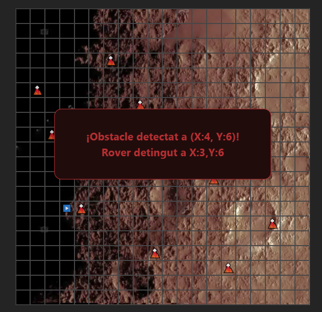

# 🚀 Mars Rover - Simulador de Comandes

Aquest projecte és una simulació d’un rover que es mou sobre una quadrícula de 20x20 caselles, seguint una seqüència de comandes donades per l’usuari. El rover pot girar a l’esquerra, a la dreta o avançar cap endavant segons la seva orientació actual. També detecta obstacles i evita sortir dels límits de la quadrícula.

-------------------------------------------------------

## 🧪 Prova Tècnica - Missió Mars Rover

### 🎯 Objectiu

Formes part de l’equip que explora Mart enviant vehicles controlats remotament a la superfície del planeta. El teu objectiu és desenvolupar un programari que tradueixi les comandes enviades des de la Terra a instruccions que el rover pugui entendre i executar.

### 📋 Requisits

- Es dona un punt inicial (x, y) del rover i la direcció (N, S, E, O) cap a on està orientat.
- El rover rep una seqüència de comandes (per exemple: `FFRRFFFRL`).
- El rover pot avançar cap endavant (`f`).
- El rover pot girar a l'esquerra (`l`) i a la dreta (`r`).
- Suposem que ens trobem en un planeta quadrat molt estrany, per exemple, una quadrícula de 200x200.
- Cal implementar la detecció d'obstacles abans de cada moviment. Si durant l’execució d’una seqüència de comandes es detecta un obstacle, el rover es desplaçarà fins l’últim punt possible, s’aturarà, i informarà de l’obstacle detectat.

### 🚨 Tingues en compte

Els rovers són molt cars, així que assegura’t que el programari funcioni com s’espera.


-------------------------------------------------------

## 📦 Instal·lació i execució local

Segueix els següents passos per clonar el repositori i executar l'aplicació en local:

### 1. Clonar el repositori

Obre una terminal i executa la comanda següent:

```bash
git clone https://github.com/Xerxi88/Mars-Rover-Mission-Housfy.git
cd Mars-Rover-Mission-Housfy
```

### 2. Obre el projecte en el teu editor de codi

Recomanem utilitzar Visual Studio Code per una millor experiència de desenvolupament. Pots obrir el projecte amb:

```bash
code .
```
### 3. Obre una terminal dins de l’editor

Un cop dins l’editor, obre una nova terminal integrada (Ctrl + \ o des del menú superior: Terminal > New Terminal).

### 4. Instal·lar les dependències

Assegura’t de tenir instal·lat Node.js (versió recomanada: 18 o superior).

```bash
npm install
```

### 5. Iniciar el projecte en desenvolupament

```bash
npm run dev
```
L’aplicació s’obrirà automàticament al navegador a http://localhost:5173 (o un altre port si aquest està ocupat).
Si no s’obre automàticament, pots copiar i enganxar l’adreça al navegador manualment.

-------------------------------------------------------

## ⚙️ Tecnologies Utilitzades

Aquest projecte ha estat desenvolupat amb les següents eines i tecnologies:

- **Editor de codi:** [Visual Studio Code](https://code.visualstudio.com/)
- **Llenguatges:**  
  - [React.js](https://reactjs.org/) com a llibreria principal per la construcció de la interfície d'usuari  
  - [TypeScript](https://www.typescriptlang.org/) per afegir tipatge estàtic i millorar la robustesa del codi
- **Entorn d'execució:** [Vite](https://vitejs.dev/) s’ha utilitzat com a _bundler_ i servidor de desenvolupament, ja que ofereix una experiència ràpida i fiable
- **Estils:** CSS pur (no s’ha utilitzat cap llibreria de components ni pre-processadors)
- **Linter:** [ESLint](https://eslint.org/) per garantir qualitat i consistència en el codi

-------------------------------------------------------

## 🧠 Estructura del projecte i decisions tècniques

El projecte està estructurat per garantir una organització clara, mantenible i escalable. S’ha utilitzat una combinació del sistema *Atomic Design* per a la jerarquia de components i una separació per responsabilitats dins de les carpetes principals.

### 📁 Estructura general

Basat en l’estructura que genera Vite per defecte, s’han afegit les següents carpetes i fitxers dins de `src/`:

```bash
src/
├── components/         # Components organitzats segons Atomic Design
│   ├── atoms/          # Elements bàsics com botons, etiquetes o textos (ex: Modal)
│   ├── molecules/      # Combinació d'àtoms amb més funcionalitat (ex: Panell Rover)
│   ├── organism/       # Components grans i independents (ex: Rover)
├── icons/              # Icones SVG exportables i reutilitzables
├── mocks/              # Constants i dades falses per fer proves (ex: obstacles)
├── types/              # Tipus globals definits amb TypeScript (posicions, rover, etc.)
├── utils/              # Lògica del rover (ex: `roverLogic.ts`)
├── App.tsx             # Component arrel de l'aplicació
├── main.tsx            # Punt d’entrada principal (render de React)
├── App.css             # Estils globals específics del component App
├── index.css           # Estils globals generals de l'aplicació
```

-------------------------------------------------------

## 📌 Decisions tècniques

- 🧬 **Atomic Design:** S'ha aplicat aquesta metodologia per classificar els components per nivells de complexitat i ús. Això millora la llegibilitat i fomenta la reutilització.

- ⚡ **Vite com a entorn de desenvolupament:** Escollit per la seva rapidesa, suport natiu a TypeScript i una configuració lleugera.

- 💅 **Estils en CSS pur:** No s’han utilitzat llibreries externes de disseny. Tot l’estil ha estat escrit manualment per tenir control total sobre l’aspecte visual.

- 🧠 **Separació de la lògica:** Tota la lògica de moviment i comportament del rover està encapsulada a `utils/roverLogic.ts`, mantenint els components centrats en la interfície.

- 🔧 **Mocks i tipus definits:** La carpeta `mocks/` facilita proves amb dades predefinides (ex: obstacles), i `types/` garanteix la consistència amb tipatge fort.

- 🎯 **Sense dependències externes:** El projecte és completament funcional amb les eines bàsiques de React, TypeScript i CSS, mantenint-lo lleuger i fàcil de revisar.

- 🕹️ **Botons per introduir instruccions:**  
  En lloc de fer servir un camp d’entrada de text per escriure les instruccions del rover (ex: `FFRLF`), s’ha optat per una interfície amb **botons visuals** que afegeixen cada comanda de forma controlada.  
  Aquesta decisió té diversos avantatges:
  - Evita errors de l’usuari al teclejar caràcters no vàlids
  - Elimina la necessitat de validar l’entrada manualment
  - Fa l’aplicació més intuïtiva, clara i atractiva visualment

- 🗺️ **Reducció del mapa per rendiment:**  
  Tot i que l'enunciat especifica un mapa de `200x200`, per a la demo s'ha reduït la mida a `20x20` per evitar sobrecàrregues al navegador provocades pel renderitzat de 40.000 cel·les.  
  Si es desitja modificar la mida del mapa, només cal canviar el valor de la constant `size` dins del component `Rover.tsx`.

- 🧠 **Optimització del renderitzat amb `useMemo`:**  
  Per evitar renders innecessaris de la graella (sobretot quan s’introdueixen instruccions al rover), s’ha aplicat `useMemo` al component `RoverGrid`. Això assegura que la graella no es torni a renderitzar completament mentre les dades essencials no canviïn, millorant notablement el rendiment.

- 🚀 **Alternativa per escalar el mapa a 200x200 sense pèrdua de rendiment:**  
  Una solució òptima per escalar la graella a 200x200 seria utilitzar una llibreria de **render virtualitzat**, com ara [`react-window`](https://github.com/bvaughn/react-window) o [`react-virtualized`](https://github.com/bvaughn/react-virtualized), que només renderitzen les cel·les visibles a la pantalla a mesura que l’usuari fa scroll.  
  Aquestes llibreries són ideals per a interfícies amb grans quantitats d’elements.  
  No obstant això, per aquesta demo s’ha prioritzat la simplicitat i la claredat del codi, mantenint una mida de mapa més reduïda.

-------------------------------------------------------

## 🚧 Idees futures i següents passos

Tot i que el projecte compleix amb els requisits de la prova tècnica, s’han considerat possibles millores i funcionalitats extres que podrien afegir-se per fer-lo més complet, divertit i interactiu:

- 🎯 **Botó per avançar múltiples caselles:**  
  Permetre al rover avançar diverses caselles d’un sol cop mitjançant un control numèric o un botó de repetició (`+3`, `+5`, etc.).

- 🛰️ **Radar d’obstacles:**  
  Afegeix un botó de radar que escanegi l’entorn immediat del rover i indiqui la presència de nous obstacles o en mostri la seva posició en el mapa.

- 💥 **Interacció amb obstacles:**  
  Quan el rover col·lisiona amb un obstacle, es podria activar una acció per:
  - Processar o eliminar l’obstacle
  - Convertir-lo en un objecte interactiu (com un "recompte de recursos")
  - Marcar-lo com a "neutralitzat" i permetre el pas

Aquestes idees podrien ser útils per explorar la gestió d’estat més avançada, l’ús de context o stores, o fins i tot integrar sistemes de puntuació i nivells.

-------------------------------------------------------

## 📸 Captures de pantalla

Vista general del simulador del Rover en acció:


Moviment del rover i detecció d'obstacles:



-------------------------------------------------------

  ## 👤 Autoria

  Aquest projecte ha estat desenvolupat per:

  **Sergio Jiménez Cuesta**  
  *Frontend Developer*

  🔗 [LinkedIn](https://www.linkedin.com/in/sergio-jimenez-cuesta/)  
  📧 serjicu88@gmail.com 